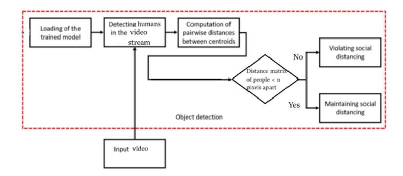
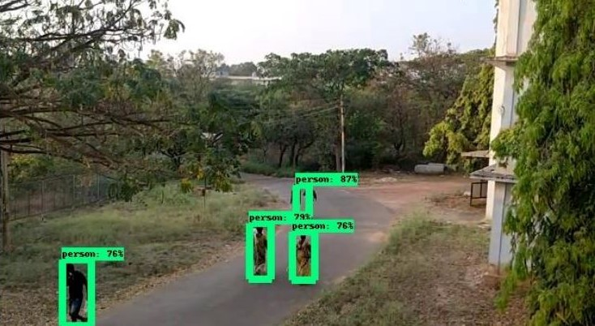
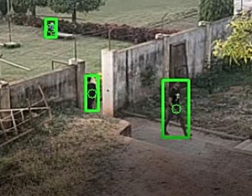
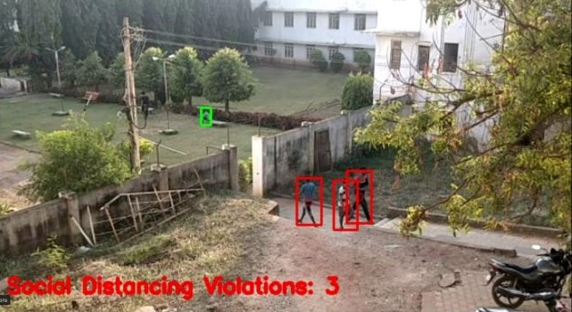
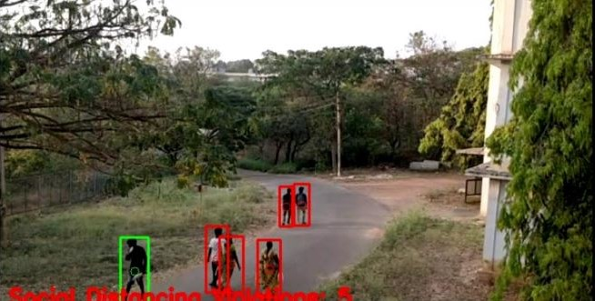

# Overview
System to determine whether an individual is following the rule of social distancing or not. 

# Algorithm
The system detects human beings in the video stream using YOLO model. It then computes the pairwise distance between the people with respect to their centroids. System checks whether the distance matrix of people less than N pixels apart, if Yes then People maintaining Social Distancing or else violating the rule. The dataset used for training is COCO dataset. 

# Dataset Description
COCO is a dataset that includes object 
identification, segmentation, and captioning on a wide scale. The name of the dataset, 
Common Objects in Context (COCO), literally means "everyday objects captured from 
everyday scenes." This gives the objects captured in the scenes some "meaning." The input 
video from the real world was used as the test data.

# Methodology
For Transfer Learning, the YOLOv3 model is used, which has been pre-trained on the COCO 
data collection. We measured the distance between each detected bounding box of people using Euclidean 
distance. Following the calculation of centroid size, a predefined threshold is used to 
determine if the distance between any two bounding box centroids is less than or equal to the 
configured number of pixels. If two people are near and their distance value exceeds the 
minimum social distance threshold. The bounding box data is saved in a violation set, and 
the bounding box colour is updated/changed to red. For monitoring, a centroid tracking 
algorithm is used, which aids in the identification of individuals who violate or break the 
social distancing threshold.

# Object Detection
After detection, the bounding box 
information, centroid information is used to compute each bounding box centroid 
distance.

# Centroid Based Object Tracking

Euclidean distance is used to calculate the distance between each detected bounding box 
of peoples. 

Case 1: No Violations

Case 2: With Violations

# CONCLUSION

From our Literature Survey, the trials 
included common state-of-the-art object detection models such as Faster RCNN, SSD, and 
we calculated for YOLO v3. YOLO v3 demonstrated efficient performance with balanced 
FPS = 23. Since this method is highly sensitive to the camera's spatial position, it can be fine-tuned to better align with the corresponding field of view.
